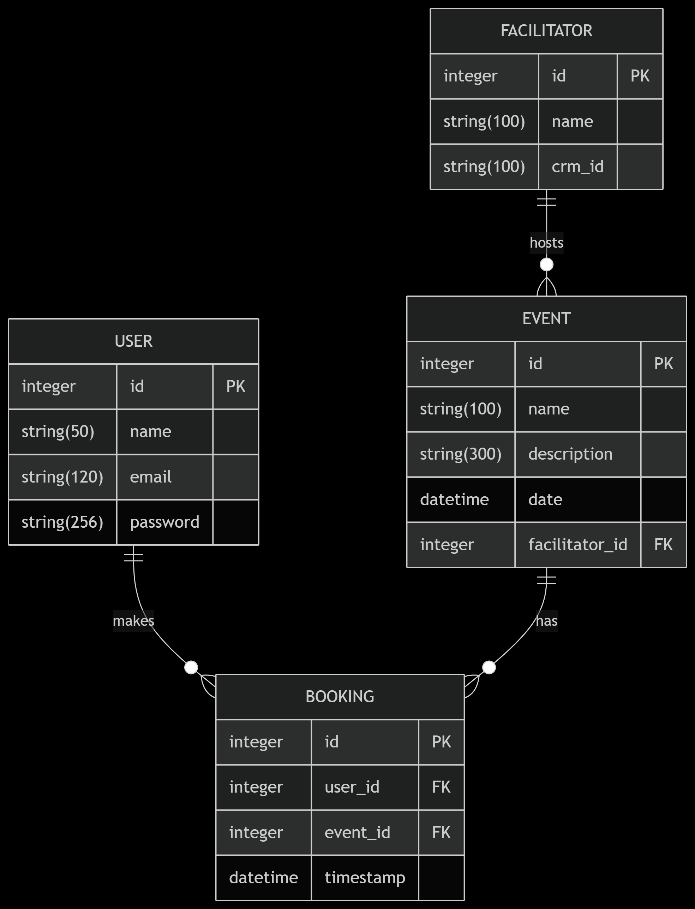

# 🧾 Booking System – Ahoum Backend Assignment

A RESTful Flask API for booking sessions and retreats.  
Implements user authentication, session booking, CRM webhook notifications, and a dashboard UI.

---

## 📚 Postman API Documentation  
https://documenter.getpostman.com/view/40688989/2sB34bM464

---

## ✅ Features

- JWT‑based user authentication (Register / Login / Logout)  
- View list of available events/sessions  
- Book an event (prevents duplicates)  
- CRM webhook notification on booking  
- View user bookings  
- Input validation with Marshmallow schemas  
- Dashboard UI (Flask + Jinja2)  
- PostgreSQL‑Railway Deployed

---

## 🛠 Tech Stack

- Python 3.10+  
- Flask  
- JWT via `flask-jwt-extended`  
- Marshmallow for validation  
- SQLAlchemy ORM (SQLite in dev, PostgreSQL in prod)  
- PostgreSQL (Railway deployment)  
- Postman / Hoppscotch for API testing  
- CRM webhook integration via HTTP POST  

---

## DataBase Schema 



---
 
## API Endpoints Summary

| Endpoint         | Method | Auth    | Description                   |
| ---------------- | ------ | ------- | ----------------------------- |
| `/auth/register` | POST   | —       | Register new user             |
| `/auth/login`    | POST   | —       | Login & receive JWT / session |
| `/logout`        | GET    | Session | Log out user                  |
| `/events/`       | GET    | JWT     | List upcoming events          |
| `/bookings/`     | POST   | JWT     | Create a booking              |
| `/bookings/my`   | GET    | JWT     | List user's bookings          |
| `/dashboard`     | GET    | Session | Serve user dashboard (UI)     |

---

## 🔔 CRM Webhook Notification

When a booking is confirmed, the backend sends a real-time JSON payload via HTTP POST to the configured `CRM_WEBHOOK_URL`. This helps integrate with external systems such as CRMs, analytics, or notification services.

### Payload Format

```json
{
  "booking_id": 42,
  "event": {
    "id": 3,
    "name": "Breathwork Intensive",
    "date": "2025-07-20T00:00:00Z"
  },
  "user": {
    "id": 7,
    "name": "Vaishnav",
    "email": "vaishnav@example.com"
  },
  "facilitator_crm_id": "crm_002"
}
```

---

## 🚀 Installation & Local Setup

```bash
git clone https://github.com/vaishnavv04/Ahoum-Backend.git
cd booking-system
python -m venv venv
source venv/bin/activate      # or venv\Scripts\activate (Windows)
pip install -r requirements.txt
```

## 📝 Create .env with:
```bash
DATABASE_URL=<Railway PostgreSQl>
JWT_SECRET_KEY=<your_jwt_secret>
FLASK_SECRET_KEY=<your_flask_secret>
CRM_WEBHOOK_URL=<your webhook URL>
```

## 🏃 Run Locally
```bash
python app.py
```
Access dashboard UI at http://localhost:5000/
Use Postman for API testing
